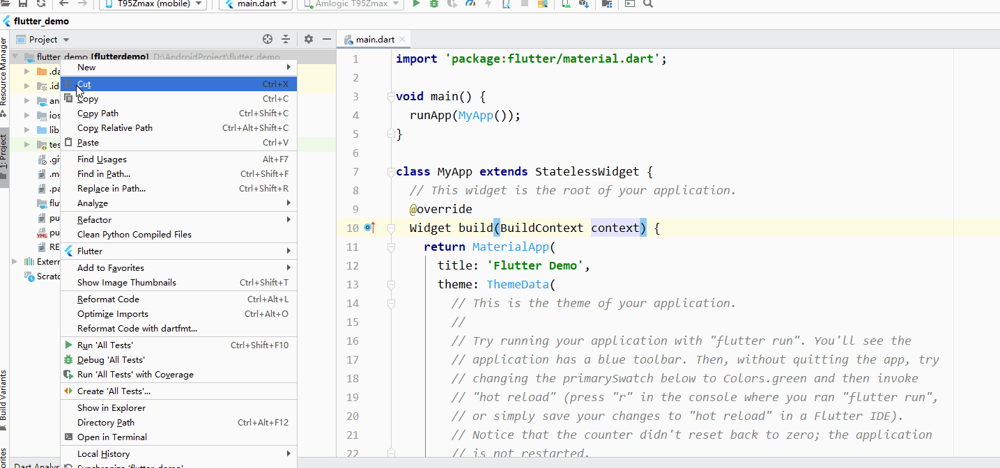
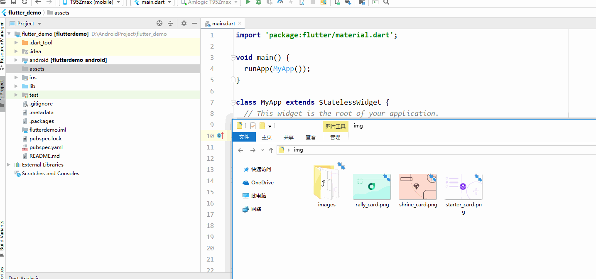
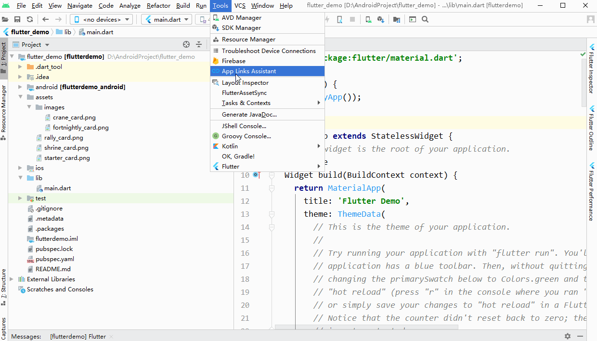

# FlutterAssetSync

Flutter Assets Image Sync, Automatic generated r.dart file ,reference image resource file .(Same as Android R.class)

# About FlutterAssetSync

	1.Support folder level import
	2.Automatic generated r.dart File 
	3.Automatic generated pubspec.yaml.temp ，current version need you coyp data to source pubspec.yaml file

# How to use

## Step 1

	create folder 'assets' folder of your project

 

## Setp 2

	Copy Image resource to assets folder or assets/xxx child folder (only support parent folder name = 'assets')

## Setp 3

	Check the 'assets' tag of the resource file,Cannot be commented（"#assets"）

- right eg:    assets:
 
- error eg:#assets:
	

## Setp 4

	Execute plugin

####### (auto update pubspec.yaml file ，not create pubspec.yaml.temp file)	

## Setp 5

Reference Image Resources

	 Image.asset(R.images_crane_card),

	 Image.asset(R.rally_card)

# Offline Install

### 1.download 

 [fluter_assets_sync](https://github.com/xiaxiayige/FlutterAssetSync/releases/download/v1.0.1/fluter_assets_sync-1.0.1-SNAPSHOT.zip)

### 2.install

	Open your Android Studio ,File -> Settings -> plugins -> (Click Settings Icon) -> 
	Install Plugin from Disk.. -> select this plugin Zip File -> restart idea 

# Change Log

	v1.0.0

	1.Support folder level import
	2.Automatic generated r.dart File 
	3.Automatic generated pubspec.yaml.temp ，need you coyp data to source pubspec.yaml file

	v1.0.1

	1.change Automatic generated pubspec.yaml.temp to auto update source pubspec.yaml file 

    v1.0.4
    
    filtering file rules（eg: MAC OS .DC_STORE and file name starting with a number）
    
    v1.0.5
        
    Support Android Studio 4.1

